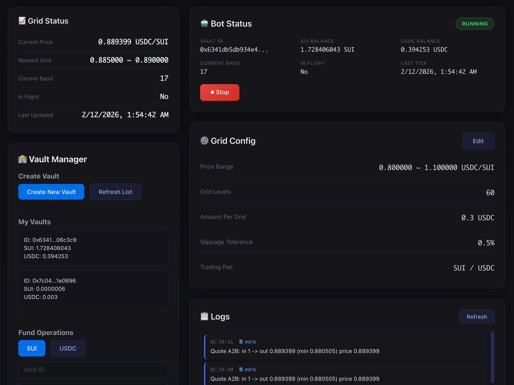

# GridVault


A grid trading bot PoC on the Sui blockchain. GridVault automates buy-low-sell-high strategies by placing orders at predefined price intervals within a range.

## Overview

GridVault consists of three main components working together:

```
┌─────────────────────────────────────────────────────────────────┐
│                    Frontend (Next.js)                           │
│         Vault Manager │ Bot Control │ Trade History             │
└─────────────────────────────────────────────────────────────────┘
                              ↕ HTTP API
┌─────────────────────────────────────────────────────────────────┐
│                     Bot Layer (Node.js)                         │
│    ┌─────────┐  ┌─────────┐  ┌─────────┐  ┌─────────┐          │
│    │Strategy │  │ Quote   │  │Executor │  │ Storage │          │
│    │ (Grid)  │  │(Cetus)  │  │ (Trade) │  │(SQLite) │          │
│    └─────────┘  └─────────┘  └─────────┘  └─────────┘          │
└─────────────────────────────────────────────────────────────────┘
                              ↕ Sui RPC / Cetus API
┌─────────────────────────────────────────────────────────────────┐
│                     On-Chain (Sui Move)                         │
│    ┌─────────┐  ┌─────────┐  ┌─────────┐  ┌─────────┐          │
│    │OwnerCap │  │TraderCap│  │  Vault  │  │ Events  │          │
│    └─────────┘  └─────────┘  └─────────┘  └─────────┘          │
└─────────────────────────────────────────────────────────────────┘
```

<video src="./resources/howitworks.mov" width="600" controls>
  您的浏览器不支持视频标签。
</video>

## How It Works

### 1. Vault Contract (Move)

The smart contract implements a dual-token vault with separated permissions:

- **Vault<A, B>**: A shared object holding balances of two tokens
- **OwnerCap**: Owner privileges (deposit/withdraw/pause)
- **TraderCap**: Trader privileges (execute trades only)

Key security features:
- Bot cannot withdraw funds directly - only the Owner can
- All swap outputs must flow back into the Vault
- Owner can pause trading at any time

### 2. Grid Trading Strategy

The bot implements a classic grid trading algorithm:

1. **Price Range**: Define a price interval `[lowerPrice, upperPrice]`
2. **Grid Levels**: Divide the range into N equal bands
3. **Signals**:
   - Price drops to a lower band → **BUY** (token A)
   - Price rises to a higher band → **SELL** (token A)
4. **Single Concurrency**: Only one trade at a time to prevent conflicts

### 3. Trade Execution Flow

```
Tick Trigger
     ↓
Fetch Cetus Price ───────────────────────────┐
     ↓                                        │
Grid Strategy Evaluation                     │
     │                                        │
     ├── Price above previous band → SELL_A   │
     │                                        │
     └── Price below previous band → BUY_A    │
                 │                            │
                 ↓                            │
         Get Cetus Aggregator Quote          │
         (route + estimated output)          │
                 │                            │
                 ↓                            │
         Build PTB (4-step atomic operation) │
                 │                            │
                 ├── 1. trader_withdraw_*    │  Withdraw from Vault
                 ├── 2. routerSwap           │  Swap via Cetus
                 ├── 3. trader_deposit_*     │  Deposit back to Vault
                 └── 4. trader_swap_*_to_*   │  Record trade
                                 │           │
                                 ↓           │
                         Sign & Submit ◀─────┘
                                 ↓
                         Wait for confirmation
                                 ↓
                         Update local state
```

### 4. Data Persistence

- **SQLite** stores grid state, trade history, and logs
- All trades are recorded with price, amounts, and timestamps
- HTTP API provides access to status, history, and configuration

## Project Structure

```
GridVault/
├── contracts/          # Move smart contracts
│   ├── sources/       # Contract source (contracts.move)
│   ├── tests/         # Move unit tests
│   └── Move.toml      # Move configuration
├── bot/               # TypeScript trading bot
│   ├── src/           # Source code
│   │   ├── strategy/  # Grid strategy implementation
│   │   ├── quote/     # Cetus Aggregator integration
│   │   ├── executor/  # Transaction execution
│   │   ├── storage/   # SQLite persistence
│   │   └── api/       # HTTP API server
│   ├── test/          # Integration tests
│   └── .env.example   # Environment template
├── frontend/          # Next.js admin panel
│   └── src/
│       ├── app/       # Pages
│       ├── components/# React components
│       └── lib/       # Utilities
└── docs/              # Documentation
    ├── ARCHITECTURE.md
    ├── DEV.md
    └── PLAN.md
```

## Quick Start

### Prerequisites

- [Sui CLI](https://docs.sui.io/guides/developer/getting-started/sui-install) installed
- Node.js 18+ and npm
- Sui wallet with testnet SUI tokens

### 1. Deploy Contracts

```bash
cd contracts

# Build the contract
sui move build

# Run unit tests
sui move test

# Deploy to testnet (requires configured sui client)
sui client publish
```

After deployment, note the `Package ID` from the output.

### 2. Configure & Start Bot

```bash
cd bot
npm install

# Copy environment template
cp .env.example .env

# Edit .env with your values:
# - SUI_PRIVATE_KEY: Your bot's private key (suiprivkey1 format)
# - PACKAGE_ID: The deployed contract package ID
# - GRID_LOWER_PRICE: Lower bound of grid range
# - GRID_UPPER_PRICE: Upper bound of grid range
# - GRID_LEVELS: Number of grid levels
# - COIN_TYPE_A, COIN_TYPE_B: Token types to trade

npm run dev          # Start bot in development mode
```

The bot API will be available at `http://localhost:3215`.

### 3. Configure & Start Frontend

```bash
cd frontend
npm install

# Copy environment template
cp .env.local.example .env.local

# Edit .env.local with your values:
# - NEXT_PUBLIC_PACKAGE_ID: The deployed contract package ID
# - NEXT_PUBLIC_BOT_API_URL: Bot API URL (default: http://localhost:3215)

npm run dev          # Start frontend (usually http://localhost:3000)
```

### 4. Setup Workflow

1. **Connect Wallet**: Open the frontend and connect your Sui wallet
2. **Create Vault**: Use Vault Manager to create a new Vault (this generates OwnerCap and TraderCap)
3. **Deposit Funds**: Deposit tokens into the Vault
4. **Transfer TraderCap**: Transfer TraderCap to the bot's address
5. **Configure Grid**: Set price range and grid levels in Bot Control
6. **Start Trading**: Click "Start" to begin automated grid trading

### 5. Run Integration Tests

```bash
cd bot

# Run all tests
npx tsx test/run-tests.ts

# Run individual tests
npx tsx test/vault-tests.ts
npx tsx test/deposit-tests.ts
npx tsx test/permission-tests.ts
```

## API Endpoints

| Endpoint | Method | Description |
|----------|--------|-------------|
| `/status` | GET | Get bot status |
| `/history` | GET | Get trade history |
| `/config` | GET/POST | Get/update grid configuration |
| `/control` | POST | Start/stop bot (`{"command": "start" \| "stop"}`) |
| `/logs` | GET | Get bot logs |

## Tech Stack

- **On-Chain**: Move (Sui) - Smart contracts
- **Bot**: Node.js + TypeScript + @mysten/sui + Cetus Aggregator SDK
- **Frontend**: Next.js + @mysten/dapp-kit-react
- **Storage**: SQLite
- **Testing**: Vitest + sui move test

## Key Features

- ✅ Second-level tick execution
- ✅ Single-concurrency transactions (prevents conflicts)
- ✅ Configurable grid strategy parameters
- ✅ Cetus Aggregator integration for optimal routing
- ✅ Complete event logging on-chain
- ✅ SQLite state persistence
- ✅ HTTP API for external control
- ✅ Web-based admin panel

## Security Design

1. **Fund Custody**: Funds are held in the on-chain Vault, Owner controls deposits/withdrawals
2. **Permission Separation**: OwnerCap (user) / TraderCap (bot) separation
3. **Pause Mechanism**: Owner can pause trading at any time
4. **Bot Cannot Withdraw**: Contract prevents bot from transferring funds out

## Development Roadmap

- [x] M1: On-chain contracts (Vault + permissions + events)
- [x] M2: Bot minimum viable product (strategy + execution + storage + API)
- [x] M3: Frontend admin panel
- [x] M4: Contract integration tests
- [ ] M5: Risk control enhancements

## Documentation

- [Architecture](./docs/ARCHITECTURE.md) - Detailed system architecture
- [Development Guide](./docs/DEV.md) - Development workflow
- [Mainnet Guide](./docs/MAINNET_GUIDE.md) - Mainnet deployment notes
- [Bot README](./bot/README.md) - Bot implementation details
- [Contracts README](./contracts/README.md) - Contract documentation
- [Frontend README](./frontend/README.md) - Frontend documentation

## License

MIT
